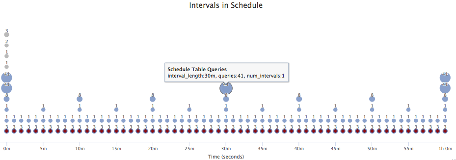

# osquery Config Report

Generates static HTML report about config queries.

## Features:
- See how many queries are run at which intervals
- See which tables are used
- Click to see details of each query
- Prettysql view of each query, along with [data/schema](./data/schema_3.3.1.csv) linkage for fields and tables

## Advisory:

Uses prettysql, which depends on [simplesql](https://github.com/packetzero/simplesql), which currently has the following known issues:
 - does not support some SQL syntax, such as 'case', 'union'.
 - can't determine field's table is field is a subquery
 - Gets some indentation wrong, such as FROM,WHERE for embedded SELECT

## Dependencies

- ruby
- [prettysql](https://github.com/packetzero/prettysql) compiled binary


## Example Detail Page
This example shows an error in simplesql formatting, where the embedded SELECT FROM,WHERE are not indented.


## Example Interval Graph



## Docker

It's easiest to run in a docker container.  The docker file will download and compile dependencies, run gen_osq_config_report.sh of each file in the directory, and serve them up in a web browser on port 8000.
```
./run_in_docker.sh /path/to/osquery/config/files
```
The output files are now in ./out directory.  To view files, open browser to http://localhost:8000/ .

## Usage

```
ruby gen_osq_config_report.rb ~/osquery/packs/*
```

You will see output of each file and query processed:
```
analyzing acpi_tables
analyzing cpuid
analyzing smbios_tables
...
ERROR analyzing query 'unauthenticated_sparkle_feeds'
analyzing backdoored_python_packages
analyzing CCleaner_Trojan.Floxif
...
analyzing unTabs_2
analyzing StickyKeys_File_Replace_Backdoor
```

The results will be in the ./out/ subdirectory.  You can open directory in a browser.  On a Mac, for example run `open ./out`
and you will see a plain HTML index file listing each config file processed.

The output files are in the following directory structure.  Where the 'q' subdirectory contains the query detail pages, and the 'c' directory contains a copy of the pretty-printed JSON config file.

